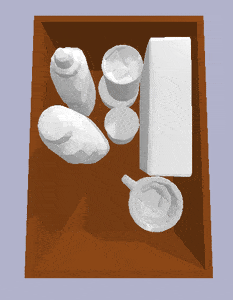
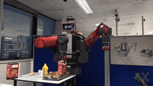

# HERB - Hierarchical Robot Learning
HERB is a framework for training robotic agents using hierarchical reinforcement learning approaches. This work is based on our paper 
[arXiv](https://arxiv.org/pdf/2504.16595)

 

## 🛠️ Installation

```bash
git clone https://github.com/NunoDuarte/herb.git
cd herb
pip install -r requirements.txt
```
### 🔧 Tested Environment
- **OS**: Ubuntu 20.04 LTS
- **Python**: 3.8
- **CUDA**: 12.0

## Pybullet Simulation
Add python path
```bash
export PYTHONPATH=/PATH/TO/herb
```
### run human packing sequences in Pybullet
```bash
python environment/physics0/replay_dataset.py
```
### run trained RL policy for test set sequences
```bash
python environment/physics0/generate_testset_packs.py
```
you can specific which sequence by looking into file ```test_set_list.json```
### run trained RL policy for any sequence of objects
```bash
python environment/physics0/test_model.py
```
you can specify the objects by changing the list in ```unpacked_list```. 
## 🔽 Download pretrained model

You can download the latest model from the [Release page](https://github.com/NunoDuarte/herb/releases/latest)  
Or directly: [Download model](https://github.com/NunoDuarte/herb/releases/download/v1.0/sac_model_c04s06.pkl)

## 🎓 Train RL
To train the HERB RL policy, run:

```bash
python environment/physics0/model/train.py
```

This will train the `custom_policy.py` model.

### System Requirements
- Adjust image size and buffer size based on your server capabilities
- Set number of parallel environments according to your CPU capacity in `train.py`

### Configuration Parameters
You can customize the training by modifying these parameters:

```python
# Box dimensions (in meters)
bin_size = [0.345987, 0.227554, 0.1637639]

# Dataset configuration
object_info = 'dataset/datas/object_info.npz'  # Contains object projections and volume data

# Training settings
visual = False          # Enable/disable rendering
ordered_objs = False    # Use Beam-3 for object ordering
reward_function = 'simple'  # Options: 'simple', 'compactness', 'compactness_stability'
alpha = 0.9            # Trade-off between compactness and stability (if using compactness_stability)

# Object volume constraints (from BioRob2024)
unpacked_list_min = 0.7  # Minimum total volume ratio
unpacked_list_max = 0.9  # Maximum total volume ratio
```

### Reward Functions
- `simple`: Basic reward for successful packing
- `compactness`: Focuses on minimizing unused space
- `compactness_stability`: Balances space utilization and object stability using `alpha` parameter

---

### 📊 Checking Pretrained Model Performance

To evaluate the performance of the pretrained model on the test set, run:

```bash
python environment/physics0/model/get_metrics_model.py
```

This script will replay the test set sequences using the pretrained RL policy and output performance metrics such as:
- Packing success rate
- Average reward
- Space utilization (compactness)
- Stability (if applicable)

The results will be printed to the console and/or saved to a results file (e.g., `test_results_episode.csv`).
You can modify or inspect the script to customize which metrics are reported.

To evaluate on custom object sequences, use:

```bash
python environment/physics0/test_model.py
```
and adjust the `unpacked_list` variable as needed.

To test the model precision without gravity and contact forces you can comment the following line `simulator/packingGame.py`
```diff
@@ -370,1 +370,1 @@
-         self.interface.simulateToQuasistatic(linearTol = 0.01, angularTol = 0.01, batch = 1.0, dt = 0.01, maxBatch = 2)
+         #self.interface.simulateToQuasistatic(linearTol = 0.01, angularTol = 0.01, batch = 1.0, dt = 0.01, maxBatch = 2)
```


## 🤖 ROS Integration
We also run the RL policy on the Baxter robot 
### Prerequisites
- ROS Noetic (Ubuntu 20.04)
- Intel RealSense SDK 2.0
- Python 3.8+
- Baxter SDK
- Additional ROS packages:
  ```bash
  sudo apt install ros-noetic-realsense2-camera
  sudo apt install ros-noetic-realsense2-description

### Environment Setup
```bash
# Set ROS network configuration
export ROS_IP=<local_pc_ip>        # Your PC's IP address
export ROS_MASTER_URI=<baxter_ip>  # Baxter robot's IP address
```

### Instructions
#### ROS master
To instruct Baxter to grasp the objects and pack it in the box run
```
python demo_camera.py
```
``` objects.csv ``` sets the object $xyz$ position in the table to grasp (manual grasp). The topic ```/target_pose``` provides the $xy\theta$ to pack the object inside the box. 

#### HERB online with ROS +  RealSense
Don't forget to set ROS_IP (local PC) and ROS_MASTER_URI (Baxter PC) for all terminals.
##### First Terminal
Open RealSense camera:
```bash
source /opt/ros/noetic.sh
roslaunch realsense2_camera rs_camera.launch
```

##### Second Terminal
Process raw depth for cropped heightmap of box (top-view):
```bash
/usr/bin/python3 realsense_depth_process.py
```

##### Third Terminal
Run baxter_demo which sends heightmap to RL to predict place location ($xy\theta$) of object on the box:
```bash
source /opt/ros/noetic.sh
/home/user/env/packbot/bin/python3 environment/physics0/baxter_demos.py
```
While baxter_demo is running the $xy\theta$ is written to ```/target_pose``` to be processed by baxter

## Troubleshooting Guide
#### Camera Issues
```bash
# Check if RealSense camera is detected
rs-enumerate-devices

# Test camera stream
realsense-viewer

# Verify camera topics
rostopic list | grep camera
```
#### Baxter Issues
```bash
# Test Baxter connectivity
ping <baxter_ip>

# Check Baxter status
rosrun baxter_tools enable_robot.py -s

# Verify joint states
rostopic echo /robot/joint_states

# Check ROS environment variables
echo $ROS_MASTER_URI
echo $ROS_IP
```

## 📄 Citation

If you find this code useful, please cite:
```bibtex
@article{perovic2025herb,
  title={HERB: Human-augmented Efficient Reinforcement learning for Bin-packing},
  author={Perovic, Gojko and Duarte, Nuno Ferreira and Dehban, Atabak and Teixeira, Gon{\c{c}}alo and Falotico, Egidio and Santos-Victor, Jos{\'e}},
  journal={arXiv preprint arXiv:2504.16595},
  year={2025}
}
```
Link to [BioRob2024](https://arxiv.org/abs/2210.01645)


